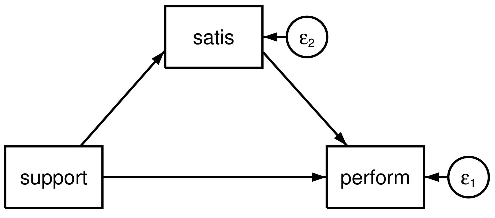

~~~
<<dd_ignore>>
---
title: Mediation with svyset data
author: Josh Errickson
output:
  html_document:
    toc: yes
    toc_depth: 4
    toc_float: yes
---
<</dd_ignore>>
~~~~

Mediation models in Stata are fit with the `sem` command. `sem` does not support `svyset` data, so instead you use `gsem` (e.g. `svy: gsem
...`). However, `gsem` does not support `estat teffects` which calculates direct, indirect and total effects.

This document shows how to manually calculate these effects using `nlcom`.

Note that this is a case where all variables are continuous and all models are linear - we are only using `gsem` for it's support of `svy:`, not it's
support of GLMs. Indirect effects are a more complicated topic in those models which we do not address here. Additionally, we'll trust Stata to
compute standard errors rather than getting into any sticky issues of bootstrapping.

^#^ Standard Mediation

First, let's estimate the direct, indirect and total effects without the use of the survey design to show equivalence.

~~~~
<<dd_do>>
webuse gsem_multmed
<</dd_do>>
~~~~

The model we'll be fitting is

Here, "satis" is a potential mediator between "support" and "perform". The direct effect is the arrow between "support" and "perform", the indirect
effect is the arrows from "support" to "perform" which passes through "satis", and the total effect is the sum of the direct and indirect effects.

~~~~
<<dd_do>>
sem (perform <- satis support) (satis <- support)
<</dd_do>>
~~~~

The direct, indirect and total effects can be estimated via `estat teffects`.

~~~~
<<dd_do>>
estat teffects
<</dd_do>>
~~~~

Let's calculate them manually. First we'll re-display the SEM results with the `coeflegend` to obtain the names to access the coefficients.

~~~~
<<dd_do>>
sem, coeflegend
<</dd_do>>
~~~~

The main effects are directly from the model, but for completeness let's obtain it.

~~~~
<<dd_do>>
estat teffects, noindirect nototal
nlcom _b[perform:support]
<</dd_do>>
~~~~

For the indirect effect, we'll simply multiply the path from "support" to "satis" and from "satis" to "perform".

~~~~
<<dd_do>>
estat teffects, nodirect nototal
nlcom _b[perform:satis]*_b[satis:support]
<</dd_do>>
~~~~

Finally, we can sum those for the direct effect.

~~~~
<<dd_do>>
estat teffects, nodirect noindirect
nlcom _b[perform:satis]*_b[satis:support] + _b[perform:support]
<</dd_do>>
~~~~

^#^ With survey data

We'll reproduce the above results with survey set data. The actually `svyset` here is nonsense, this test data is not actual survey data.

~~~~
<<dd_do>>
svyset branch [pweight = perform]
<</dd_do>>
~~~~

To use the `svy` prefix, we switch from `sem` to `gsem`.

~~~~
<<dd_do>>
svy: gsem (perform <- satis support) (satis <- support)
<</dd_do>>
~~~~

Finally, all three effects can be calculated via the same `nlcom` commands.

~~~~
<<dd_do>>
* main effect
nlcom _b[perform:support]

* Indirect effect
nlcom _b[perform:satis]*_b[satis:support]

* Total effect
nlcom _b[perform:satis]*_b[satis:support] + _b[perform:support]

<</dd_do>>
~~~~
